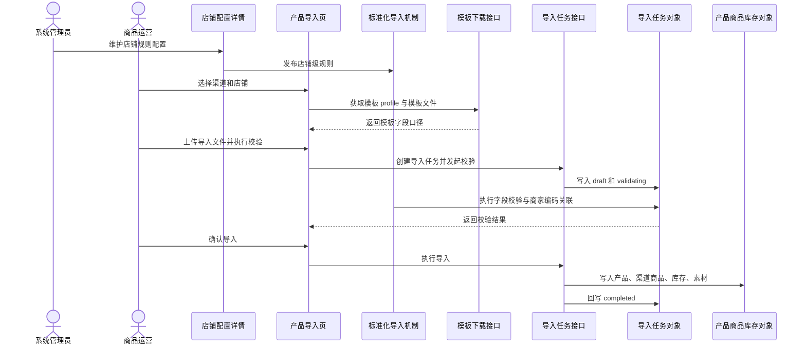
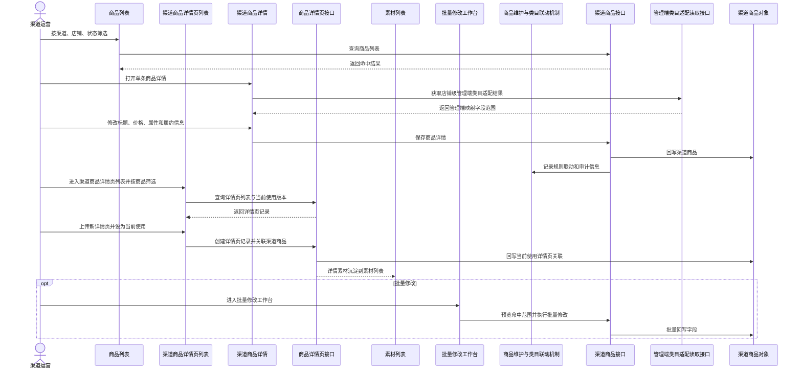
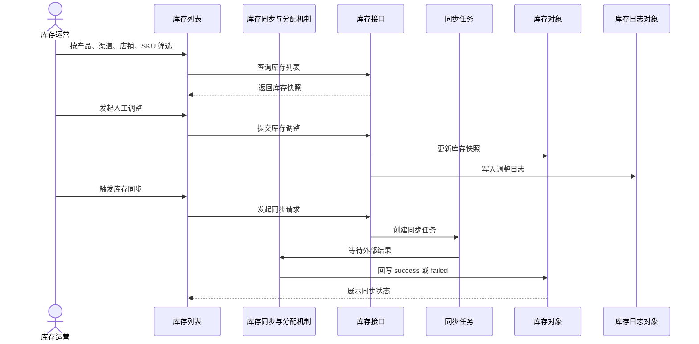
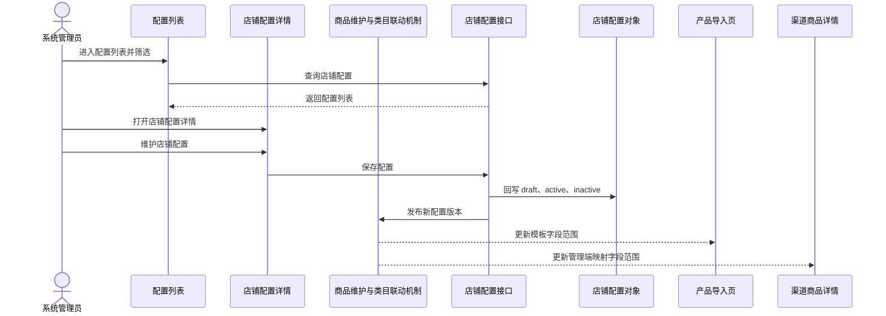

# 图书多渠道商品中台-整体业务流程图

| 字段 | 内容 |
|---|---|
| 文档名称 | 04-整体业务流程图.md |
| doc_id | DOC-BIZ-FLOW |
| doc_slug | business-flow |
| 文档层级 | 00-总览层 |
| 文档对象 | 业务流程图 |
| 适用端 | 中台用户端 |
| 上游文档 | 01-产品总述.md；02-业务模型与角色协同.md；../baselines/02-functional-carrying-diagram.md |
| 下游文档 | ../02-专题机制层/；../03-页面设计层/；../05-验收与测试层/02-主流程测试场景.md |
| baseline_version | BSL-2026-04-20-A |
| doc_version | 2026-04-22-r1 |
| doc_status | current-effective |
| 更新时间 | 2026-04-22 |

## 1. 总览流程图

## 2. 业务线拆分说明

- 导入业务线：承接模板下载、上传校验、商家编码关联和导入落库。
- 商品维护业务线：承接导入后商品的单条编辑、商品详情页管理、管理端映射结果读取和批量修改。
- 库存业务线：承接库存查看、人工调整和同步回写。
- 配置业务线：承接店铺配置维护；类目动态适配由中台管理端映射规则承接。

## 3. 导入业务线时序图

## 4. 商品维护业务线时序图

## 5. 库存业务线时序图

## 6. 配置业务线时序图

