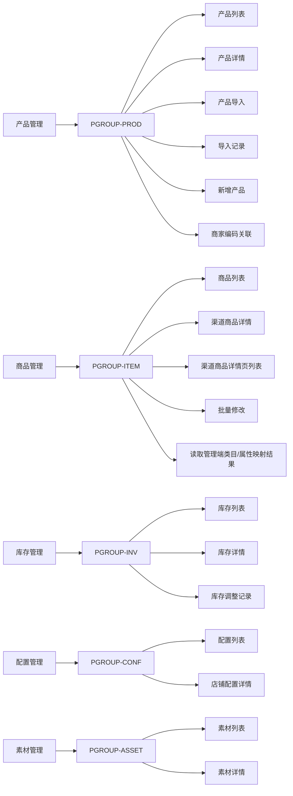

# 图书多渠道商品中台-中台用户端产品文档

| 字段 | 内容 |
|---|---|
| 文档名称 | 05-中台用户端产品文档.md |
| doc_id | DOC-TERMINAL-USER |
| doc_slug | terminal-user-product-doc |
| 文档层级 | 01-端产品层 |
| 文档对象 | 端产品 |
| 适用端 | 中台用户端 |
| 所属角色 | 商品运营、渠道运营、库存运营、系统管理员 |
| 所属功能 | 产品管理、素材管理、商品管理、库存管理、配置管理 |
| 所属页面组 | PGROUP-PROD、PGROUP-ASSET、PGROUP-ITEM、PGROUP-INV、PGROUP-CONF |
| 关联机制 | MECH-IMPORT-STD、MECH-ITEM-MAINTAIN、MECH-INV-SYNC、MECH-AUTH-AUDIT |
| 上游文档 | ../baselines/00-feature-list.md；../baselines/01-page-tree.md；../baselines/02-functional-carrying-diagram.md |
| 下游文档 | ../02-专题机制层/；../03-页面设计层/；../04-数据与接口层/；../05-验收与测试层/ |
| baseline_version | BSL-2026-04-20-A |
| doc_version | 2026-04-24-r1 |
| doc_status | current-effective |
| 更新时间 | 2026-04-22 |

## 1. 端定位

中台用户端是一体化中台的业务操作端，用于承接产品导入、产品主档维护、导入后渠道商品编辑、商品详情页管理、库存统一维护和店铺配置维护。

## 2. 使用角色

| 角色 | 核心目标 | 核心入口 | 关键产出 |
|---|---|---|---|
| 商品运营 | 完成产品主档维护和导入闭环 | 产品列表、产品导入、导入记录 | 产品主档、导入任务、关联处理结果 |
| 渠道运营 | 维护导入后商品的渠道差异信息和详情页内容 | 商品列表、渠道商品详情页列表、渠道商品详情 | 商品标题、价格、属性、详情页内容、素材复用关系、上下架信息 |
| 库存运营 | 统一维护库存与同步结果 | 库存列表 | 库存快照、调整结果、同步状态 |
| 系统管理员 | 维护店铺配置 | 店铺管理、店铺配置详情 | 生效中的默认类目、运费模板、发货时效等配置 |

## 3. 核心场景

| 场景 | 参与角色 | 场景说明 | 主要结果 |
|---|---|---|---|
| 多渠道商品标准化导入 | 商品运营、系统管理员 | 先选择渠道商品导入或产品资料导入；渠道商品导入按单渠道、已授权店铺范围和单渠道类目下载模板，产品资料导入按产品类目下载模板，上传校验并确认导入 | 渠道商品导入统一落库产品、渠道商品、库存、素材；产品资料导入只维护产品主档和素材 |
| 渠道商品编辑与详情页维护 | 渠道运营 | 对已导入商品做单条字段编辑，并在渠道商品详情页列表统一管理详情页上传、内容编辑、版本切换和素材复用 | 导入后商品资料和详情内容持续可维护 |
| 库存统一维护 | 库存运营 | 按产品、渠道、店铺、SKU 维度查看和调整库存，并触发同步 | 库存快照和同步状态可追踪 |
| 店铺配置维护 | 系统管理员 | 在中台用户端按店铺维护默认类目、运费模板、默认上下架状态和发货时效；类目动态适配规则由中台管理端维护 | 店铺配置与管理端映射结果共同支撑导入和商品维护 |

## 4. 导航结构

| 一级功能 | 当前一级入口 | 当前二级入口 | 非菜单页 / 动作页入口 | 当前状态 | 说明 |
|---|---|---|---|---|---|
| 产品管理 | 产品列表 | 产品导入 | 产品详情（列表内容进入）、导入记录（导入页进入）、新增产品（列表按钮进入） | V1.0 | 产品导入是独立二级菜单，不从产品列表主路径承接。 |
| 商品管理 | 商品列表 | 渠道商品详情页列表、批量修改 | 渠道商品详情（列表内容进入） | V1.0 | 渠道商品详情页列表是V1.0二级菜单；批量修改属于V1.0二级入口。 |
| 库存管理 | 库存列表 | 库存调整记录 | 库存详情（列表内容进入） | V1.0 | 库存调整记录属于V1.0二级入口。 |
| 配置管理 | 配置列表 | - | 店铺配置详情（列表内容进入） | V1.0 | 店铺配置详情是详情页，不单独作为菜单入口。 |
| 素材管理 | 素材列表 | - | 素材详情（列表内容进入） | V1.0 | 素材管理整体为V1.0。 |

- 本节描述的是产品基线中的“入口语义”，不是当前前端目录结构本身。
- 后续菜单路由调整必须先遵守上游入口关系，再决定隐藏路由、回挂父菜单等实现策略。

## 5. 一级功能总表

| 功能模块 | 主页面组 | V1.0页面/动作 | 规则能力 |
|---|---|---|---|---|
| 产品管理 | PGROUP-PROD | 产品列表、产品详情、产品导入、导入记录、新增产品 | 商家编码关联 |
| 商品管理 | PGROUP-ITEM | 商品列表、渠道商品详情页列表、渠道商品详情、批量修改 | 读取中台管理端类目/属性映射结果 |
| 库存管理 | PGROUP-INV | 库存列表、库存详情、库存调整记录 | 库存调整、库存同步 |
| 配置管理 | PGROUP-CONF | 店铺管理、店铺配置详情 | 店铺配置维护 |
| 素材管理 | PGROUP-ASSET | 素材列表、素材详情 | - |

## 6. 功能清单表

| feature_id | 功能名称 | 节点类型 | 优先级 | 当前状态 | 主要承接位置 |
|---|---|---|---|---|---|
| FEAT-PROD | 产品管理 | 一级功能 | 0 | V1.0 | PGROUP-PROD |
| FEAT-PROD-LIST | 产品列表 | 页面 | 0 | V1.0 | PG-PROD-LIST |
| FEAT-PROD-DETAIL | 产品详情 | 页面 | 0 | V1.0 | PG-PROD-DETAIL |
| FEAT-PROD-IMPORT | 产品导入 | 页面 | 0 | V1.0 | PG-PROD-IMPORT |
| FEAT-PROD-IMPORT-LOG | 导入记录 | 页面 | 0 | V1.0 | PG-PROD-IMPORT-LOG |
| FEAT-PROD-MERCHANT-LINK | 商家编码关联 | 规则能力 | 0 | V1.0 | MECH-IMPORT-STD |
| FEAT-PROD-CREATE | 新增产品 | 功能动作 | 0 | V1.0 | PGROUP-PROD |
| FEAT-ASSET | 素材管理 | 一级功能 | 0 | V1.0 | PGROUP-ASSET |
| FEAT-ASSET-LIST | 素材列表 | 页面 | 0 | V1.0 | PG-ASSET-LIST |
| FEAT-ASSET-DETAIL | 素材详情 | 页面 | 0 | V1.0 | PG-ASSET-DETAIL |
| FEAT-ITEM | 商品管理 | 一级功能 | 0 | V1.0 | PGROUP-ITEM |
| FEAT-ITEM-LIST | 商品列表 | 页面 | 0 | V1.0 | PG-ITEM-LIST |
| FEAT-ITEM-DETAIL | 渠道商品详情 | 页面 | 0 | V1.0 | PG-ITEM-DETAIL |
| FEAT-ITEM-DETAIL-PAGE-LIST | 渠道商品详情页列表 | 页面 | 0 | V1.0 | PG-ITEM-DETAIL-PAGE-LIST |
| FEAT-ITEM-BATCH-EDIT | 批量修改 | 功能动作 | 0 | V1.0 | ACTION-ITEM-BATCH-EDIT |
| FEAT-INV | 库存管理 | 一级功能 | 0 | V1.0 | PGROUP-INV |
| FEAT-INV-LIST | 库存列表 | 页面 | 0 | V1.0 | PG-INV-LIST |
| FEAT-INV-DETAIL | 库存详情 | 页面 | 0 | V1.0 | PG-INV-DETAIL |
| FEAT-INV-LOG | 库存调整记录 | 页面 | 0 | V1.0 | PG-INV-LOG |
| FEAT-CONF | 配置管理 | 一级功能 | 0 | V1.0 | PGROUP-CONF |
| FEAT-CONF-LIST | 配置列表 | 页面 | 0 | V1.0 | PG-CONF-LIST |
| FEAT-CONF-SHOP-DETAIL | 店铺配置详情 | 页面 | 0 | V1.0 | PG-CONF-DETAIL |

## 7. 页面树表

| page_id | page_group_id | route_key | route_name | route_path | menu_key | active_menu_key | 菜单可见性 | 页面名称 | 页面类型 | 当前状态 |
|---|---|---|---|---|---|---|---|---|---|---|
| PG-PROD-LIST | PGROUP-PROD | `product.list` | `ProductList` | `/products/list` | `menu.product` | `menu.product` | 显示 | 产品列表 | 列表页 | V1.0 |
| PG-PROD-DETAIL | PGROUP-PROD | `product.detail` | `ProductDetail` | `/products/detail` | - | `menu.product` | 隐藏 | 产品详情 | 详情页 | V1.0 |
| PG-PROD-IMPORT | PGROUP-PROD | `product.import` | `ProductImport` | `/products/import` | `menu.product.import` | `menu.product.import` | 显示 | 产品导入 | 工作页 | V1.0 |
| PG-PROD-IMPORT-LOG | PGROUP-PROD | `product.import_log` | `ProductImportRecords` | `/products/import-records` | - | `menu.product.import` | 隐藏 | 导入记录 | 记录页 | V1.0 |
| PG-ASSET-LIST | PGROUP-ASSET | `asset.list` | `MaterialList` | `/materials/list` | `menu.asset` | `menu.asset` | 显示 | 素材列表 | 列表页 | V1.0 |
| PG-ASSET-DETAIL | PGROUP-ASSET | `asset.detail` | `MaterialDetail` | `/materials/detail` | - | `menu.asset` | 隐藏 | 素材详情 | 详情页 | V1.0 |
| PG-ITEM-LIST | PGROUP-ITEM | `item.list` | `ChannelItemList` | `/channel-items/list` | `menu.channel_item` | `menu.channel_item` | 显示 | 商品列表 | 列表页 | V1.0 |
| PG-ITEM-DETAIL | PGROUP-ITEM | `item.detail` | `ChannelItemDetail` | `/channel-items/detail` | - | `menu.channel_item` | 隐藏 | 渠道商品详情 | 详情页 | V1.0 |
| PG-ITEM-DETAIL-PAGE-LIST | PGROUP-ITEM | `item.detail_page_list` | `ChannelItemDetailPageList` | `/channel-items/detail-pages` | `menu.channel_item.detail_page_list` | `menu.channel_item.detail_page_list` | 显示 | 渠道商品详情页列表 | 列表页 | V1.0 |
| PG-INV-LIST | PGROUP-INV | `inventory.list` | `InventoryList` | `/inventory/list` | `menu.inventory` | `menu.inventory` | 显示 | 库存列表 | 列表页 | V1.0 |
| PG-INV-DETAIL | PGROUP-INV | `inventory.detail` | `InventoryDetail` | `/inventory/detail` | - | `menu.inventory` | 隐藏 | 库存详情 | 详情页 | V1.0 |
| PG-INV-LOG | PGROUP-INV | `inventory.adjust_log` | `InventoryAdjustments` | `/inventory/adjustments` | `menu.inventory.adjust_log` | `menu.inventory.adjust_log` | 显示 | 库存调整记录 | 记录页 | V1.0 |
| PG-CONF-LIST | PGROUP-CONF | `config.list` | `StoreConfigList` | `/store-config/list` | `menu.config` | `menu.config` | 显示 | 配置列表 | 列表页 | V1.0 |
| PG-CONF-DETAIL | PGROUP-CONF | `config.shop_detail` | `StoreConfigDetail` | `/store-config/detail` | - | `menu.config` | 隐藏 | 店铺配置详情 | 详情页 | V1.0 |

## 8. 功能承载图

## 9. 页面组与页面映射关系

| 页面组 | V1.0页面 | V1.0页面/动作 | 关联机制 |
|---|---|---|---|
| PGROUP-PROD | 产品列表、产品详情、产品导入、导入记录 | 新增产品 | MECH-IMPORT-STD、MECH-AUTH-AUDIT |
| PGROUP-ITEM | 商品列表、渠道商品详情页列表、渠道商品详情 | 批量修改 | MECH-ITEM-MAINTAIN、MECH-AUTH-AUDIT；类目动态适配规则由中台管理端维护 |
| PGROUP-INV | 库存列表 | 库存详情、库存调整记录 | MECH-INV-SYNC、MECH-AUTH-AUDIT |
| PGROUP-CONF | 配置列表、店铺配置详情 | - | MECH-AUTH-AUDIT；不维护类目动态适配规则 |
| PGROUP-ASSET | - | 素材列表、素材详情 | - |

## 10. 端边界与协同关系

- 中台用户端只承接商品中台业务操作，不承接客户开通、客户隔离、映射治理和管理端用户维护。
- 客户、类目映射、属性值映射和管理端用户维护归中台管理端。
- 外部渠道系统仍然是商品售卖和库存同步的目标系统，但不作为当前项目文档交付端。

## 11. 优先级与版本范围

| 功能优先级 | 版本范围 | 具体内容 |
|---|---|---|
| 0 | V1.0 | 产品管理、素材管理、商品管理、库存管理、配置管理下全部页面、动作和规则能力。 |

## 12. 前端实现提醒

- 当前仓库的前端目录和路由文件只是实现落点，不能反向覆盖产品基线中的来源入口关系。
- 菜单路由调整时，应以 `docs/baselines/00-feature-list.md` 和 `docs/baselines/01-page-tree.md` 为上游事实：
  产品导入和渠道商品详情页列表是V1.0二级菜单直达，批量修改是V1.0二级菜单直达，库存调整记录是V1.0二级菜单直达，新增产品是列表按钮进入。
- `渠道商品详情页列表` 与 `渠道商品详情` 必须拆页：前者统一管理全部渠道商品的详情页内容、版本和素材复用，后者只维护单商品售卖字段。
- 同一产品在多个渠道售卖时会形成多个渠道商品，因此会对应多套详情页；单个渠道商品最多允许 3 个详情页，前端需在列表页直接展示和管控该限制。
- 详情页和记录页是否采用隐藏路由、`activePath` 或其他父菜单回挂方案，属于实现策略；实现时不得把这些策略写回成上游入口语义。
- `overview/`、`system-config/`、`publish/`、`operations/`、`reports/` 属于历史兼容目录，不得作为当前菜单树和页面树输入。
- 任何菜单排序、路径或显隐策略调整，都要同步回写 `docs/baselines/01-page-tree.md`、`docs/00-总览层/08-需求追踪矩阵.md` 和 `docs/03-页面设计层/中台用户端/99-页面开发脚手架定义.md`。
