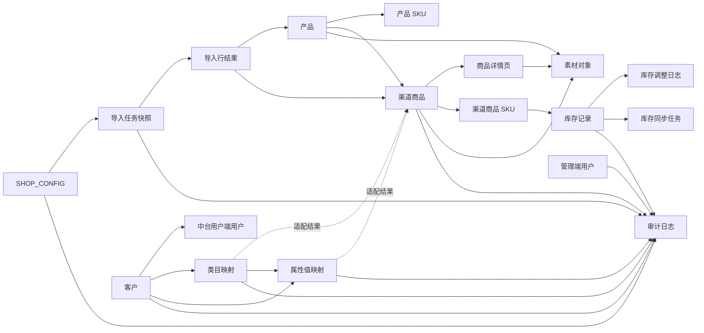

# 图书多渠道商品中台-逻辑数据模型

| 字段 | 内容 |
|---|---|
| 文档名称 | 02-逻辑数据模型.md |
| doc_id | DOC-DATA-MODEL |
| doc_slug | logical-data-model |
| 文档层级 | 04-数据与接口层 |
| 文档对象 | 逻辑数据模型 |
| 上游文档 | 01-核心对象定义.md |
| 下游文档 | 03-字段字典.md；07-表设计建议.md |
| baseline_version | BSL-2026-04-20-A |
| doc_version | 2026-04-24-r3 |
| doc_status | current-effective |
| 更新时间 | 2026-04-24 |

## 1. 关系图

## 2. 核心关系表

| 主对象 | 关系 | 从对象 | 说明 |
|---|---|---|---|
| 产品 | 1:N | 产品 SKU | 一个产品下可有多个产品 SKU。 |
| 产品 | 1:N | 渠道商品 | 同一产品可映射到多个渠道和多个店铺。 |
| 渠道商品 | 1:N | 商品详情页 | 同一渠道商品最多可关联 3 个详情页记录，仅允许一个当前使用版本。 |
| 渠道商品 | 1:N | 渠道商品 SKU | 商品详情中的销售属性最终落到 SKU。 |
| 渠道商品 SKU | 1:1 | 库存记录 | V1.0每个渠道商品 SKU 对应一条库存主记录。 |
| 库存记录 | 1:N | 库存调整日志 | 每次人工调整和同步回写都要留痕。 |
| 库存记录 | 1:N | 库存同步任务 | 同一库存记录可多次发起同步请求。 |
| 中台管理端类目映射 | N:1 | 渠道商品 | 渠道商品根据客户、渠道、店铺和类目读取映射结果。 |
| 导入任务 | 1:N | 导入行结果 | 每个导入任务记录行级状态和异常。 |
| 产品/渠道商品/商品详情页 | 1:N | 素材对象 | 素材按产品、商品、详情页或 SKU 绑定。 |
| 多业务对象 | 1:N | 审计日志 | 导入、编辑、库存、配置动作统一审计。 |
| 客户 | 1:N | 中台用户端用户 | 中台用户端用户必须归属客户。 |
| 客户 | 1:N | 类目映射 | 类目映射按客户隔离。 |
| 客户 | 1:N | 属性值映射 | 属性值映射按客户隔离。 |
| 类目映射 | 1:N | 属性值映射 | 属性值映射建议依附类目映射上下文。 |
| 管理端用户 | 无客户归属 | 客户 | 管理端用户独立于客户，不参与客户隔离。 |

## 3. 一致性规则

1. `channel_item.product_id` 必须引用已存在产品主档。
2. `inventory.channel_item_sku_id` 必须引用已存在的渠道商品 SKU。
3. `shop_config.status=active` 的同店铺同渠道版本只允许一条。
4. 类目动态适配必须来源于中台管理端有效类目映射和属性值映射，不能由中台用户端店铺配置写入。
5. `import_job_line` 在完成关联处理前，不允许进入最终执行成功状态。
6. 同一 `channel_item_id` 下的商品详情页记录最多 3 条，且只允许一条处于 `current` 使用状态。
7. 审计日志必须记录 `biz_type + biz_id + action_type + operator_id + created_at`。
8. 中台用户端用户、类目映射和属性值映射必须携带 `customer_id`。
9. 管理端用户不允许携带 `customer_id` 作为归属字段。
10. 类目映射停用后，其下属性值映射不得继续作为 active 规则使用。

## 4. 当前建模取舍

- V1.0不引入仓库、仓位、多仓调拨模型，库存统一在单库存池处理。
- 导入任务保留配置快照引用，避免配置版本变更导致历史任务不可回溯。
- 商品详情页记录与渠道商品详情页拆开建模，避免把多版本详情内容混在单商品售卖字段模型里，并支撑同一素材跨商品详情页复用。
- 素材管理虽然是V1.0，但对象模型和绑定关系必须先保留稳定结构。
- 中台管理端当前以固定角色枚举承接账号权限，不单独建复杂 RBAC 模型。
