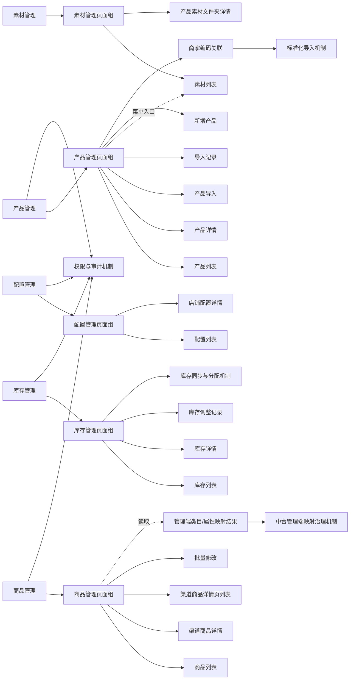
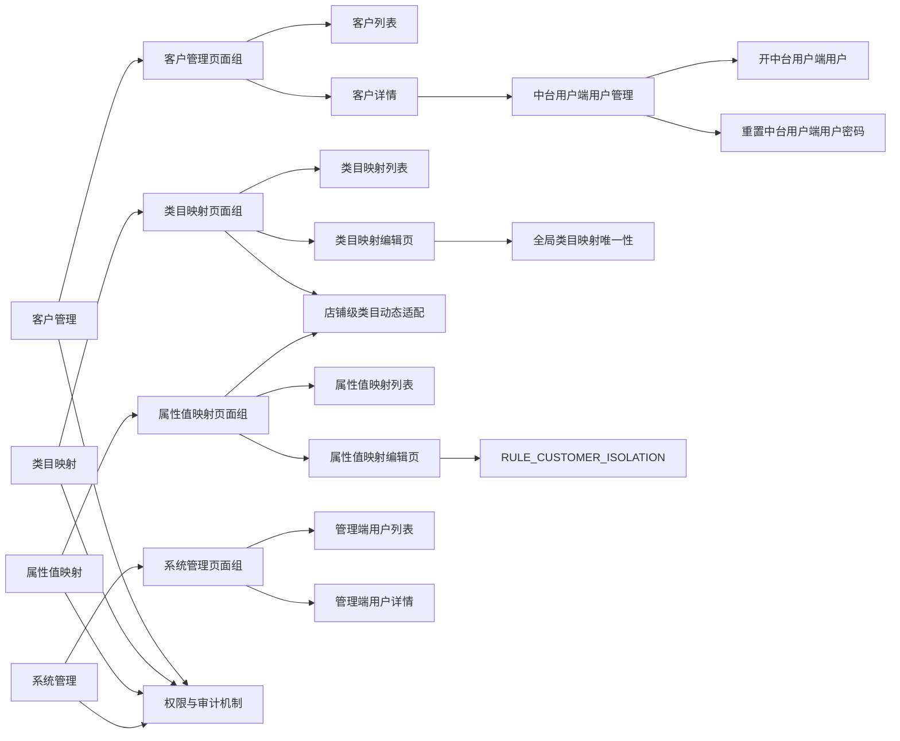

# 图书多渠道商品中台-功能承载图

| 字段 | 内容 |
|---|---|
| 文档名称 | 02-functional-carrying-diagram.md |
| doc_id | BL-FUNC-CARRY |
| doc_slug | functional-carrying-diagram |
| 文档层级 | baseline |
| 文档对象 | 功能承载图 |
| 适用端 | 中台用户端；中台管理端 |
| 所属角色 | 产品经理、产品 Agent、研发、测试 |
| baseline_version | BSL-2026-04-20-A |
| doc_version | 2026-04-24-r3 |
| doc_status | current-effective |
| 更新时间 | 2026-04-24 |

## 1. 说明

- 本图回答“每个功能最终由哪个页面组、页面、功能动作或专题机制承接”。
- 功能动作和规则能力虽然不在页面树中，但必须在承载图中明确位置。

## 2. 承载图

## 3. 当前说明

- 当前不纳入历史独立发布相关页面、系统配置详情、渠道配置详情、导入模板配置页和操作日志页。
- 以上历史路径保留文档占位，但不进入当前基线和前端任务。

## 4. 中台管理端V1.0承载图

### 4.1 承载说明

- 中台用户端用户管理由客户详情承接，不建立独立一级菜单或脱离客户上下文的全局列表。
- 店铺级类目动态适配由中台管理端的类目映射和属性值映射共同承接；中台用户端只读取适配结果。
- 类目映射不按客户隔离，新增或保存不要求 `customer_id`；属性值映射仍按自身页面组规则处理。
- 管理端用户只属于中台管理端自身，不与客户建立归属关系。
