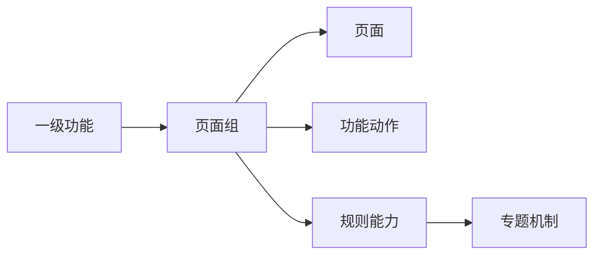

# 输入基线规范

| 字段 | 内容 |
|---|---|
| 文档名称 | 03_baseline_artifacts.md |
| 文档类型 | 输入基线规范 |
| 适用范围 | 需求收敛、范围治理、文档生成前置输入 |
| 适用角色 | 产品经理、产品 Agent |
| 当前版本 | V1 |
| 维护人 | 产品 Agent 标准维护者 |
| 更新时间 | 2026-04-17 |

## 1. 文档目标

本文件定义三份必须先于项目实例文档存在的输入基线：

1. 功能清单表
2. 页面树表
3. 功能承载图

这三份内容决定“当前做什么、页面如何组织、能力最终由谁承接”。

三份基线的存放位置、文件载体和引用方式，以 `15_baseline_storage_format_spec.md` 为准。

## 2. 功能清单表

### 2.1 作用

功能清单表回答的是：

`当前版本范围内到底有哪些能力节点`

### 2.2 推荐字段

| feature_id | parent_feature_id | 功能层级 | 功能名称 | 节点类型 | 所属端/渠道 | 所属角色 | 优先级 | 版本范围 | 当前状态 | 承接页面组/机制 | 来源 | 备注 |
|---|---|---|---|---|---|---|---|---|---|---|---|---|

### 2.3 强制规则

- `feature_id` 必须稳定且唯一
- 优先级从 `0` 开始排序，数字越小优先级越高
- `节点类型` 至少区分：
  - `页面`
  - `功能动作`
  - `规则能力`
  - `机制能力`
  - `数据能力`
- 只要不是页面节点，也必须有明确承接对象
- 任何新增、删除、拆分、合并功能节点，先更新这张表

`feature_id` 的命名规则和废弃规则，以 `12_id_traceability_spec.md` 为准。

### 2.4 状态建议

`当前状态` 建议至少支持：

- `待确认`
- `当前范围`
- `扩展预留`
- `已下线`

## 3. 页面树表

### 3.1 作用

页面树表回答的是：

`页面如何组织，页面之间是什么层级关系`

### 3.2 推荐字段

| page_id | parent_page_id | page_group_id | route_key | menu_key | 页面名称 | 菜单名称 | 所属端/渠道 | 所属功能 | 页面类型 | 页面层级 | 入口说明 | 默认出口 | 前置条件 | 版本范围 | 当前状态 | 备注 |
|---|---|---|---|---|---|---|---|---|---|---|---|---|---|---|---|---|

### 3.3 强制规则

- 页面树表只放页面节点
- 功能动作不得进入页面树表
- 规则能力不得进入页面树表
- `page_id` 必须稳定且能与页面文档一一映射
- `route_key` 应作为路由稳定键，不随中文页面名调整而频繁变化
- `menu_key` 应作为导航稳定键，不随菜单文案调整而频繁变化
- 页面新增、删除、改父子关系、改入口出口时，先更新这张表

`page_id` 与 `page_group_id` 的命名规则，以 `12_id_traceability_spec.md` 为准。

菜单名、页面名、路由键、文件路径之间的解耦规则，以 `16_navigation_naming_resilience_spec.md` 为准。

### 3.4 页面类型建议

`页面类型` 建议至少支持：

- `列表页`
- `详情页`
- `工作页`
- `记录页`
- `弹窗页`
- `抽屉页`

## 4. 功能承载图

### 4.1 作用

功能承载图回答的是：

`功能最终由哪个页面组、页面、功能动作、规则能力或机制承接`

### 4.2 最少表达关系

功能承载图至少应表达以下关系：

- 功能 -> 页面组
- 页面组 -> 页面
- 页面组 -> 功能动作
- 页面组 -> 规则能力
- 规则能力 -> 专题机制

### 4.3 推荐 Mermaid 模板

### 4.4 使用规则

- 功能承载图是范围承接图，不是用户操作流程图
- 页面、功能动作、规则能力发生承接变化时，必须先回写这张图
- 如果业务线较多，可以按业务线或按端拆分为多张承载图，但命名和关系口径必须一致

## 5. 三份基线的一致性规则

三份基线必须相互可追溯：

- 页面树表中的页面，必须能在功能清单表中找到对应功能节点或归属功能
- 功能清单表中的非页面节点，必须能在功能承载图中找到承接关系
- 功能承载图中的页面组、页面、机制，必须能追溯到页面树表或专题机制文档

## 6. 变更顺序规则

当前范围变化时，回写顺序固定为：

1. 功能清单表
2. 页面树表
3. 功能承载图

只有三份基线回写完成后，才允许更新项目实例文档。

## 7. 可选扩展字段

为了支持后续迭代，建议在功能清单表和页面树表中预留以下字段：

- `change_type`
- `change_reason`
- `changed_by`
- `changed_at`
- `effective_version`
- `trace_status`
- `linked_docs`

## 8. 基线完成标准

满足以下条件时，三份基线可视为可进入正式文档阶段：

- 当前版本范围已经明确
- 页面与非页面节点已经分开治理
- 每个核心能力都能找到承接对象
- 页面层级关系与入口出口关系清晰
- 三份基线之间不存在明显冲突

## 9. 基线到文档的覆盖率规则

为了保证“写了文档”不等于“写全了文档”，必须满足以下覆盖率要求：

- 每个 `page_id` 必须对应一个页面文档，或在所属页面组文档中有独立章节承接
- 每个 `page_group_id` 必须对应一个页面组级文档或端产品层映射章节
- 每个 `rule_capability` 必须对应一个专题机制说明文档
- 每个 `data_capability` 必须对应一个对象、字段或接口定义文档
- 每个 `feature_id` 至少能追溯到一个端产品层文档中的章节或表格

如果某个节点尚未落到下游文档，必须在基线中标记为待补充，不应默认视为已完成。
