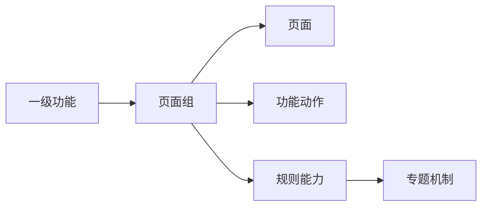

# 产品文档模板库规范

| 字段 | 内容 |
|---|---|
| 文档名称 | 11_template_library.md |
| 文档类型 | 模板库规范 |
| 适用范围 | 基线表、分层文档、脚手架定义、问题清单的模板骨架 |
| 适用角色 | 产品经理、产品 Agent |
| 当前版本 | V1 |
| 维护人 | 产品 Agent 标准维护者 |
| 更新时间 | 2026-04-17 |

## 1. 文档目标

本文件提供一套可直接复用的模板骨架，避免不同项目、不同 Agent 每次重新定义章节顺序和字段结构。

## 2. 使用原则

模板库的作用不是限制项目表达，而是保证：

- 输出结构一致
- 缺项容易发现
- 多人协作容易汇总
- 后续迭代容易回写

如果某个章节当前不适用，可以标记“当前不适用”，不建议直接删空导致结构不完整。

## 3. 通用元信息头模板

所有项目实例文档建议至少使用以下头部：

```md
| 字段 | 内容 |
|---|---|
| 文档名称 |  |
| doc_id |  |
| doc_slug |  |
| 文档层级 |  |
| 文档对象 |  |
| 适用端 |  |
| 所属角色 |  |
| 所属功能 |  |
| 所属页面组 |  |
| 关联机制 |  |
| 关联对象 |  |
| 上游文档 |  |
| 下游文档 |  |
| 当前版本 |  |
| 维护人 |  |
| 更新时间 |  |
```

## 4. 输入基线模板

### 4.1 功能清单表模板

```md
| feature_id | parent_feature_id | 功能层级 | 功能名称 | 节点类型 | 所属端/渠道 | 所属角色 | 优先级 | 版本范围 | 当前状态 | 承接页面组/机制 | 来源 | 备注 |
|---|---|---|---|---|---|---|---|---|---|---|---|---|
```

### 4.2 页面树表模板

```md
| page_id | parent_page_id | page_group_id | route_key | menu_key | 页面名称 | 菜单名称 | 所属端/渠道 | 所属功能 | 页面类型 | 页面层级 | 入口说明 | 默认出口 | 前置条件 | 版本范围 | 当前状态 | 备注 |
|---|---|---|---|---|---|---|---|---|---|---|---|---|---|---|---|---|
```

### 4.3 功能承载图模板



## 5. 分层文档模板骨架

### 5.1 00-总览层模板

建议章节：

1. 文档目标
2. 产品目标与范围边界
3. 角色与协同关系
4. 核心对象与状态
5. 主业务流程
6. 关键约束
7. 变更与治理说明

### 5.2 01-端产品层模板

建议章节：

1. 端定位
2. 使用角色
3. 核心场景
4. 导航结构
5. 一级功能总表
6. 功能清单表
7. 页面树表
8. 功能承载图
9. 页面组与页面映射关系
10. 跨端协同关系
11. 优先级与版本范围

### 5.3 02-专题机制层模板

建议章节：

1. 机制目标
2. 触发条件
3. 流转规则
4. 失败与回退
5. 页面承接点
6. 对象承接点
7. 异常场景

### 5.4 03-页面组文档模板

建议章节：

1. 页面组目标
2. 页面清单
3. 跨页动作
4. 页面间入口出口关系
5. 与机制的关系
6. 状态与反馈

### 5.5 03-单页面文档模板

建议章节：

1. 页面目标
2. 页面结构
3. 页面布局
4. 区块说明
5. 主次操作
6. 字段与校验
7. 状态与反馈
8. 依赖对象与接口

### 5.6 04-数据与接口层模板

建议章节：

1. 对象定义
2. 字段字典
3. 状态与枚举
4. 接口清单
5. 事件与日志
6. 表设计建议

### 5.7 05-验收与测试层模板

建议章节：

1. 验收目标
2. 主流程用例
3. 异常用例
4. 权限用例
5. 状态流转用例
6. 回归范围

## 6. 页面开发脚手架模板

建议章节：

1. 脚手架对象
2. 脚手架类型
3. 页面映射关系
4. 目录结构
5. 路由与入口
6. 区块骨架
7. 状态骨架
8. 接口挂载
9. 复用组件约束

## 7. 问题清单模板

```md
| issue_id | 问题类型 | 问题内容 | 影响范围 | 阻塞等级 | 默认处理方式 | 待确认角色 | 待确认人 | 当前状态 | 备注 |
|---|---|---|---|---|---|---|---|---|---|
```

## 8. 人类确认记录模板

```md
| issue_id | 确认方式 | 确认结论 | 确认人 | 确认角色 | 确认时间 | 影响文档 | 是否已回写 | 关闭状态 |
|---|---|---|---|---|---|---|---|---|
```

## 9. 模板使用完成标准

模板真正发挥作用时，至少应满足：

- 项目实例文档不再频繁自定义章节骨架
- 多个 Agent 产出的文档可直接汇总
- 评审时能够快速对照模板发现缺项

## 10. 常用固定枚举建议

为了减少同义不同写，建议统一以下枚举：

### 10.1 节点类型

- `页面`
- `功能动作`
- `规则能力`
- `机制能力`
- `数据能力`

### 10.2 当前状态

- `待确认`
- `当前范围`
- `扩展预留`
- `已下线`

### 10.3 文档状态

- `draft`
- `review`
- `approved`
- `locked`
- `deprecated`
- `archived`

### 10.4 问题类型

- `范围问题`
- `页面结构问题`
- `机制规则问题`
- `对象字段问题`
- `接口依赖问题`
- `验收口径问题`
- `术语命名问题`

### 10.5 确认方式

- `口头确认`
- `文档批注确认`
- `会议确认`
- `消息确认`

### 10.6 脚手架类型

- `list_page`
- `detail_page`
- `form_page`
- `record_page`
- `dashboard_page`
- `modal_flow`

## 11. 流程图与时序图模板约束

建议在流程图和时序图中遵循以下约束：

- 参与者命名保持一致，不同图不要同义改名
- 节点粒度以“角色 / 页面 / 机制 / 对象 / 接口”为主
- 图中的关键节点尽量能映射到稳定 ID
- 多业务线时，时序图按业务线拆分，不强行并成一张大图
- 图中如使用缩写，应在正文中给出解释

## 12. 变更记录模板

建议至少使用如下模板：

```md
| change_id | change_type | change_reason | changed_by | changed_at | affected_docs | affected_ids | summary |
|---|---|---|---|---|---|---|---|
```

## 13. 决策记录模板

建议至少使用如下模板：

```md
| decision_id | 决策主题 | 候选方案 | 最终方案 | 决策原因 | 决策人 | 决策时间 | 影响范围 |
|---|---|---|---|---|---|---|---|
```
